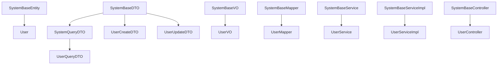

# System模块公共基础组件架构

## 概述
本文档描述了System模块的公共基础组件体系，为业务开发提供统一的基础架构支撑。

## 基础组件层次结构

### 1. 实体层 (Entity)
```
com.cobazaar.system.entity.base
├── SystemBaseEntity.java     # 基础实体类
└── (业务实体继承此基类)

com.cobazaar.system.entity
└── User.java                 # 用户实体（继承SystemBaseEntity）
```

**SystemBaseEntity特性：**
- 主键ID（雪花算法）
- 创建/更新时间自动填充
- 创建/更新人自动填充
- 逻辑删除支持
- 乐观锁版本控制

### 2. 数据传输层 (DTO/VO)

#### DTO组件
```
com.cobazaar.system.dto.base
├── SystemBaseDTO.java        # 基础DTO
├── SystemQueryDTO.java       # 查询DTO基类（含分页参数）
└── (业务DTO继承相应基类)

com.cobazaar.system.dto.user
├── UserCreateDTO.java        # 用户创建DTO
├── UserUpdateDTO.java        # 用户更新DTO
└── UserQueryDTO.java         # 用户查询DTO（继承SystemQueryDTO）
```

#### VO组件
```
com.cobazaar.system.vo.base
├── SystemBaseVO.java         # 基础VO
└── (业务VO继承此基类)

com.cobazaar.system.vo.user
└── UserVO.java               # 用户VO（继承SystemBaseVO）
```

### 3. 数据访问层 (Mapper)
```
com.cobazaar.system.mapper
├── SystemBaseMapper.java     # 基础Mapper接口
├── UserMapper.java           # 用户Mapper（继承SystemBaseMapper）
└── impl/
    └── SystemBaseMapperImpl.java  # 基础Mapper实现
```

### 4. 服务层 (Service)
```
com.cobazaar.system.service
├── SystemBaseService.java    # 基础服务接口
├── UserService.java          # 用户服务接口
└── impl/
    ├── SystemBaseServiceImpl.java  # 基础服务实现
    └── UserServiceImpl.java        # 用户服务实现
```

### 5. 控制层 (Controller)
```
com.cobazaar.system.controller
├── base/
│   └── SystemBaseController.java  # 基础控制器
└── UserController.java            # 用户控制器
```

## 组件间继承关系



## 使用规范

### 1. 实体类开发
```java
@Data
@EqualsAndHashCode(callSuper = true)
@TableName("table_name")
public class BusinessEntity extends SystemBaseEntity {
    // 业务字段
}
```

### 2. DTO开发
```java
// 查询DTO
@Data
public class BusinessQueryDTO extends SystemQueryDTO {
    // 查询字段
}

// 创建/更新DTO
@Data
public class BusinessCreateDTO extends SystemBaseDTO {
    // 业务字段
}
```

### 3. VO开发
```java
@Data
public class BusinessVO extends SystemBaseVO {
    // 返回字段
}
```

### 4. Mapper开发
```java
@Mapper
public interface BusinessMapper extends SystemBaseMapper<BusinessEntity> {
    // 自定义查询方法
}
```

### 5. Service开发
```java
public interface BusinessService extends SystemBaseService<BusinessEntity> {
    // 业务方法定义
}

@Service
public class BusinessServiceImpl extends SystemBaseServiceImpl<BusinessMapper, BusinessEntity> 
        implements BusinessService {
    // 业务方法实现
}
```

### 6. Controller开发
```java
@RestController
@RequestMapping("/api/business")
@RequiredArgsConstructor
public class BusinessController extends SystemBaseController<
        BusinessService, BusinessEntity, 
        BusinessCreateDTO, BusinessUpdateDTO, 
        BusinessQueryDTO, BusinessVO> {
    
    // 实现具体的业务方法
    @Override
    protected BusinessVO doCreate(BusinessCreateDTO createDTO) {
        // 具体实现
    }
    
    // ... 其他抽象方法实现
}
```

## 核心特性

1. **统一的字段管理**：所有实体自动包含创建时间、更新时间等通用字段
2. **自动填充机制**：时间戳、操作人等字段自动维护
3. **逻辑删除支持**：内置软删除机制
4. **乐观锁控制**：防止并发更新冲突
5. **分页查询标准**：统一的分页和排序参数
6. **模板方法模式**：Controller层提供CRUD模板方法
7. **类型安全保障**：编译期类型检查，减少运行时错误

## 扩展建议

1. 根据具体业务需求，在基类基础上扩展专用字段
2. 在BaseMapper中添加通用的批量操作方法
3. 在BaseService中添加业务通用的统计方法
4. 在 BaseController 中添加权限校验等通用逻辑
5. 建立完善的单元测试覆盖基础组件功能